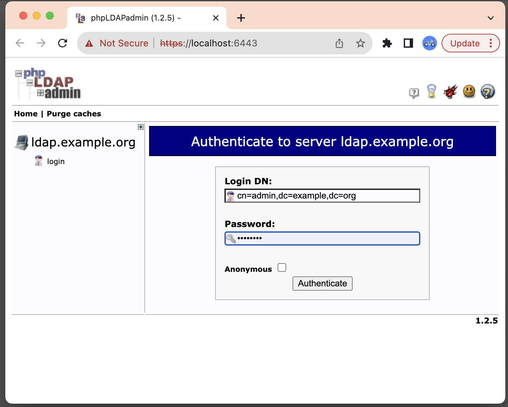
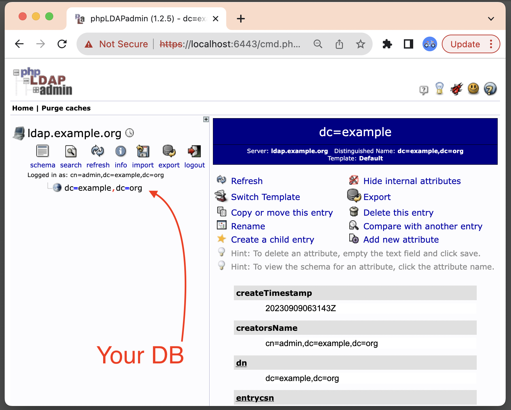
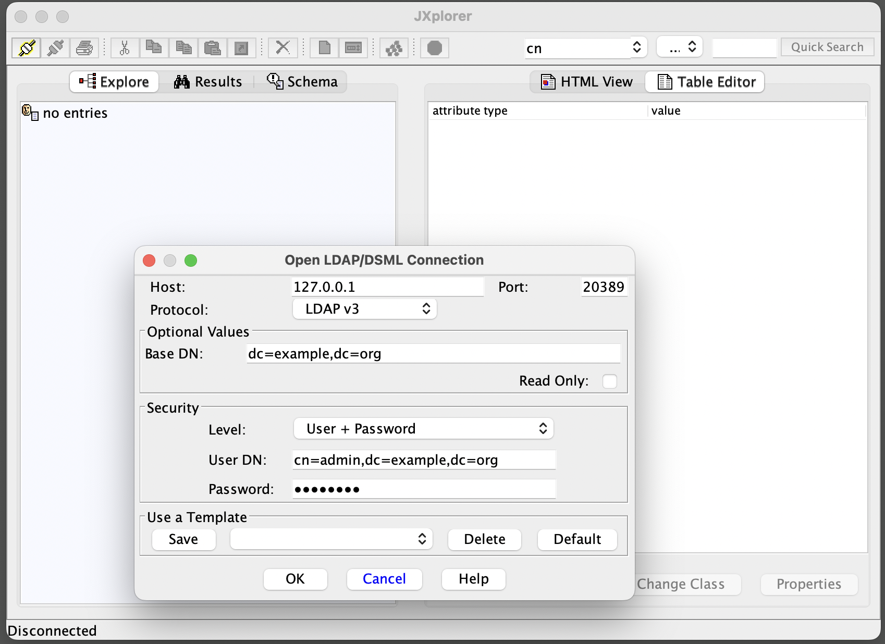
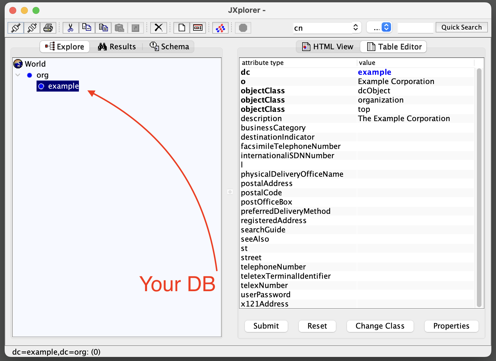

# Quick Start

This folder contains set of LDIF files to start Docker container based on image `theanurin/openldap`.

After start a container use `ldap://127.0.0.1:20389` to access OpenLDAP server.

```
ldapsearch -H "ldap://127.0.0.1:20389" -x -D "cn=config" -w "openldap" -b "cn=config"
```

## Run OpenLDAP container

```shell
cd quick-start

docker run --rm --interactive --tty \
  --name ldap.example.org \
  --mount "type=bind,source=${PWD}/slapd-init.d,target=/data/etc/slapd-init.d" \
  --publish 127.0.0.1:20389:389 \
  --env SLAPD_DEBUG_LEVEL=-1 \
  theanurin/openldap
```

## Initialize Database `dc=example,dc=org`

```shell
cd quick-start

docker exec --user root ldap.example.org mkdir /data/db/org.example
docker exec --user root ldap.example.org chown ldap:ldap /data/db/org.example

ldapmodify -H "ldap://127.0.0.1:20389" -x -D "cn=config" -w "openldap" \
  -f org-example-db-template/10config_olcDatabase.ldapmodify.ldif

ldapadd -H "ldap://127.0.0.1:20389" -x -D "cn=admin,dc=example,dc=org" -w "openldap" \
  -f org-example-db-template/20org_example.ldif
```

## Manage Database `dc=example,dc=org`

- Bind DN: `cn=admin,dc=example,dc=org`
- Bind Password: `openldap`


### Manage Database `dc=example,dc=org` via [PHP LDAP Admin](http://www.phpldapadmin.org/) via Docker

1. Start PHP LDAP Admin
    ```shell
    docker run --rm --interactive --tty \
      --name manage.ldap.example.org \
      --link ldap.example.org:ldap.example.org \
      --env PHPLDAPADMIN_LDAP_HOSTS=ldap.example.org \
      --publish 6443:443 \
      osixia/phpldapadmin:0.9.0
    ```
1. Open web browser at [https://127.0.0.1:6443/](https://127.0.0.1:6443/)





### Manage Database `dc=example,dc=org`via [JXplorer](http://jxplorer.org/)




